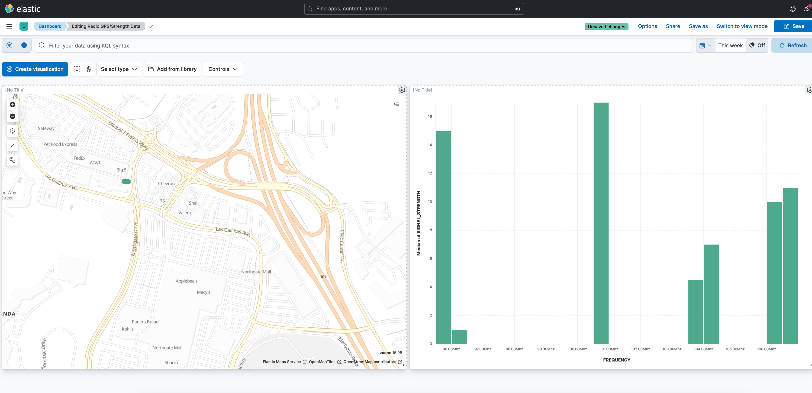

## ES/ELK Work
#### Simple collection of Elastic Work

 

---

## Links

- [Repository](https://github.com/DrSpeed/elk-stack-repo)

---
## Screenshots

Radio GPS/SignalStrength data:  

 

 
Oura Ring

---

## Available Commands

In the project directory, you can run:
To import tsv geo data into ES
### `bin/logstash -f csv_pipeline.conf`

To read Oura data into local json file
### `curl --location --request GET 'https://api.ouraring.com/v2/usercollection/daily_activity?start_date=2022-11-01&end_date=2022-12-01' --header 'Authorization: Bearer...`
---
## Built With

- EL (ELK) 8.5.3
- bash curl
- Python
- VS Code
---
## Author

**Dr Speed**

- [Profile](https://github.com/DrSpeed "Steven Winter")
- [Linked In](http:/www.linkedin.com/in/steven-j-winter "Linked In")

## 🤝 Support

Give a ⭐️ if you like this project!